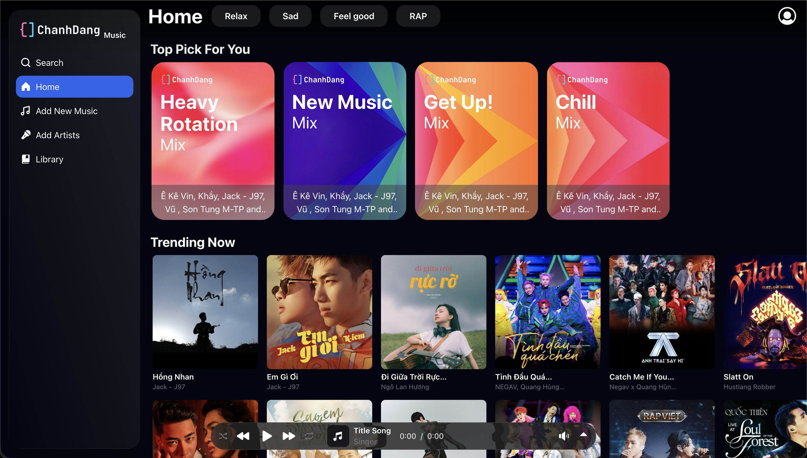
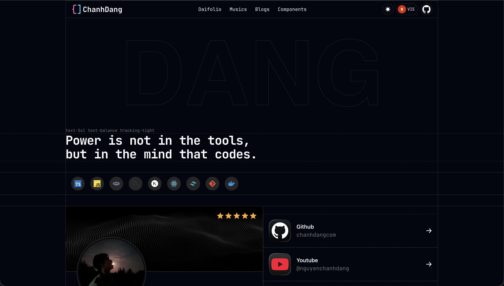
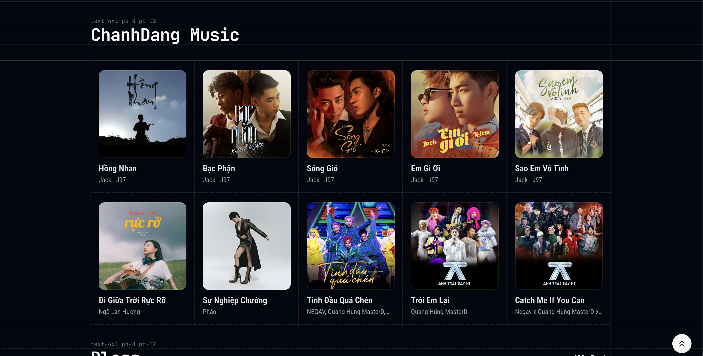
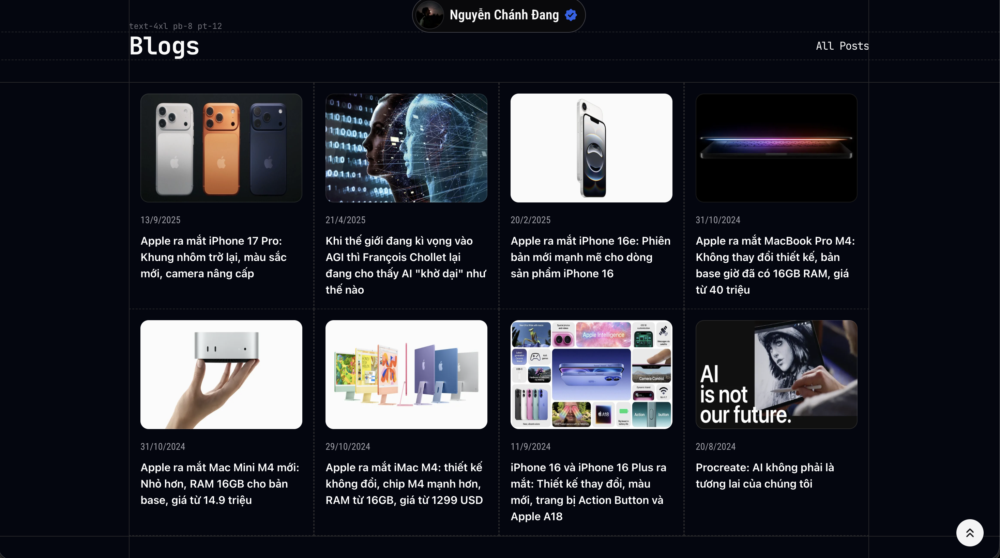
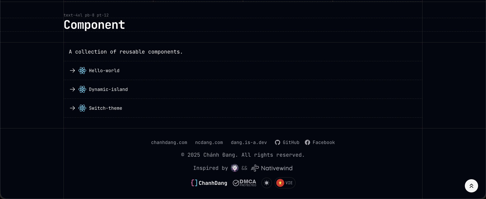
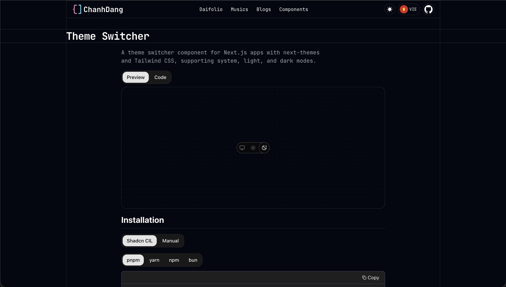
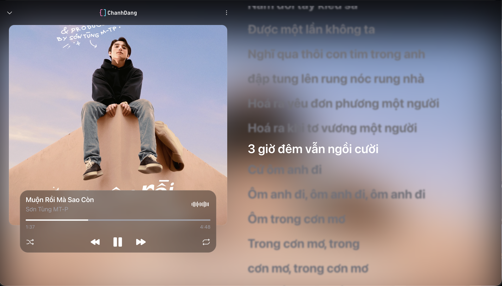

# 🌐 ChanhDang — Developer Portfolio & Music Platform

> “Power is not in the tools, but in the mind that codes.”  
> — Nguyễn Chánh Đang

---

## 🧠 About Me

Hi, I'm **Chánh Đang** — a developer passionate about building **modern web applications** and **creative tools** using  
**Next.js**, **React**, **Tailwind CSS**, and **ShadCN UI**.

I love designing clean interfaces, writing elegant code, and turning ideas into polished digital products.

> Visit my portfolio: [https://chanhdang.com](https://chanhdang.com)

---

## 🎧 ChanhDang Music

> A personal music web app inspired by Spotify, built with modern web technologies.

🌟 **Live:** [https://chanhdang.com/music](https://chanhdang.com/music)s

### ✨ Features

- 🎶 Personalized playlists (Relax, Chill, Feel Good, RAP…)
- 💿 “Top Picks” and “Trending Now” sections
- 📀 Smooth music player with lyric sync & animation
- 🎨 Built with **Next.js 15**, **Tailwind CSS**, **ShadCN UI**
- 💾 Data handled by **MongoDB**
- 🌓 Full **Dark/Light mode** theme system

---

## 🤖 NCDangBot Chat

- Truy cập trực tiếp tại [`/chatbot`](https://chanhdang.com/chatbot) trong dự án Next.js.
- UI viết bằng React + Tailwind, proxy qua API route để nói chuyện với backend Express (`NCDangBot`).
- Tin nhắn ưu tiên dữ liệu cá nhân lưu trong MongoDB, fallback sang AI nếu server gốc bật model gateway.

**Cài đặt nhanh**

1. Chạy service NCDangBot (repo `/Users/ncdang/Study/Web/NCDangBot`), để mặc định ở `http://localhost:4000`.
2. Tạo file `.env.local` trong dự án Next.js và thêm:

```
NCDANG_BOT_API_URL=http://localhost:4000
```

3. `pnpm dev` rồi mở [http://localhost:3000/chatbot](http://localhost:3000/chatbot).

---

## 🖼️ Screenshots

|                                               |                                             |                                                  |
| :-------------------------------------------: | :-----------------------------------------: | :----------------------------------------------: |
|            |  |  |
|  |      |           |
|   |                                             |                                                  |

> _Modern, minimalist interface with smooth transitions and responsive layouts._

---

## 🛠️ Tech Stack

| Frontend   | UI & Design   | Backend     | Other      |
| ---------- | ------------- | ----------- | ---------- |
| Next.js 15 | Tailwind CSS  | MongoDB     | ShadCN UI  |
| React      | Framer Motion | Next Themes | TypeScript |

---

## 🧩 Components Library

A growing collection of reusable UI components built with React + Tailwind CSS:

- ⚡ **Hello-world**
- 🌙 **Switch-theme**
- 🌀 **Dynamic-island**

Explore: [https://chanhdang.com/components](https://chanhdang.com/components)

---

## 📰 Blog Highlights

I write about:

- Web development & design
- Modern JavaScript/React techniques
- AI & creative coding insights
- Apple ecosystem updates

Read more: [https://chanhdang.com/blogs](https://chanhdang.com/blogs)

---

## 🌎 Connect with me

- 💻 **GitHub:** [chanhdangcom](https://github.com/chanhdangcom)
- 🎥 **YouTube:** [@nguyenchanhdang](https://youtube.com/@nguyenchanhdang)
- 🪶 **Website:** [chanhdang.com](https://chanhdang.com)
- 🪩 **Music:** [chanhdang.com/music](https://chanhdang.com/music)

---

## 🖤 Credits

Inspired by:

- [Nativewind](https://www.nativewind.dev/)
- [ShadCN UI](https://ui.shadcn.com/)

© 2025 **Chánh Đang** — All rights reserved.
